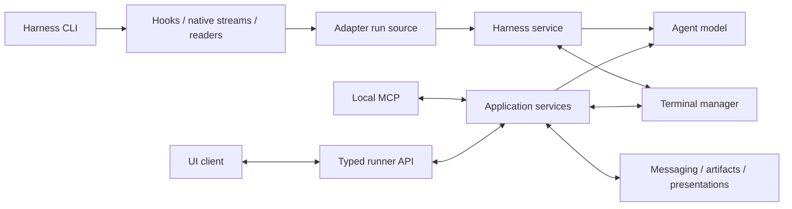

# Harness adapters

Proposed architecture for NovaDeck's Claude Code, Codex, and Antigravity
integrations. This document designs the boundary; it does not change runtime
behavior. The first implementation should preserve resume behavior, followed by
agent activity reporting.

NovaDeck presents **one normalized agent model** for Claude, Codex and AGY:
sessions, activity, permissions, questions, subagents, transcripts, plans and
usage. Per-harness adapters report facts into that model. Differences between
harnesses are not hidden as silent gaps; they surface as explicit per-feature
coverage and availability, so every client renders every harness the same way
and can still say "unknown for this harness".

Use one internal adapter per harness: a plain `Harness` table of data and small
functions, in the style of today's `shell/agents.ts`.
A shared harness service owns their lifecycle and turns their facts into the
agent model. The adapters own provider knowledge; the service owns NovaDeck
policy. The UI and NovaDeck's local MCP consume only the agent model.

In the first version, permissions and questions are **observed, not answered**.
NovaDeck shows that an agent needs attention and what it is asking; the user
answers in the terminal. Responding from NovaDeck is a later capability module
(see [Growing the interface](#growing-the-interface)).

This proposal establishes interfaces, not a claim that all three harnesses
already expose every required native signal. Contracts for observation,
transcripts and telemetry are fixed only after per-harness coverage probes
(see [Implementation sequence](#implementation-sequence)).

## Existing seams

| Current code                              | Responsibility to preserve                                                    | Destination                                                              |
| ----------------------------------------- | ----------------------------------------------------------------------------- | ------------------------------------------------------------------------ |
| `runner/src/shell/agents.ts`              | Detect config, inspect plugin connection, plan install/remove commands        | `home`, `connected`, `connect`/`disconnect`; shared inspection and setup |
| `runner/src/shell/resume.ts`              | Build the exact resume command for an identified session                      | `resume` field                                                           |
| `runner/src/shell/scripts.ts`             | Provider manifests, hook configuration, Codex launch shim                     | `files` and `shims`; shared artifact writer                              |
| `runner/src/shell/hook.ts`                | Native payload interpretation, nested-session filtering, hook response format | Per-harness `decode.ts` in the runner; one shared hook script            |
| `runner/src/shell/reports.ts`             | Authenticate and accept session reports                                       | Shared ingress and binding policy                                        |
| `runner/src/terminals/manager.ts`         | PTY lifetime, resume claims, persistence, foreground ownership                | Terminal manager, using the harness service                              |
| `ui/src/model/process.ts` and `resume.ts` | Provider recognition and resume eligibility                                   | `programs` and shared recognition; UI keeps generic program presentation |

Paths above are relative to `application/`. In particular, `acceptReport` currently
interprets native `source` values and treats a missing source specially for AGY.
That interpretation belongs in an adapter. Normalized activity reports must never
acquire or replace a terminal's session merely by supplying a different session ID.

## Boundaries



The registry is a typed map of built-in adapters. Keep the existing finite
`AgentName` union at the protocol boundary. Internally, “harness” means the CLI
product; “agent” remains the existing wire name. A workspace session is still a
group of terminals, distinct from a harness session.

Adapters are trusted application code shipped with NovaDeck. Dynamically loading
third-party code, a public plugin ABI, and compatibility with arbitrary adapter
versions are outside this proposal. NovaDeck's plugins installed into the
harnesses remain delivery mechanisms for the adapters' hooks.

| Adapter owns                                                    | Shared service/terminal manager owns                                                 |
| --------------------------------------------------------------- | ------------------------------------------------------------------------------------ |
| Native CLI arguments, config locations and interpretation       | Process execution, deadlines, cancellation and sanitized errors                      |
| Plugin manifests, event registration, hook completion format    | Atomic artifact installation and runtime paths                                       |
| Native session IDs, launch quirks, supported feature semantics  | Terminal/run binding, foreground policy and exclusive resume claims                  |
| Native payload validation and normalization                     | Envelope validation, authentication, resource bounds and publication                 |
| Joining hooks, streams and readers within one run into one feed | Session acquisition, continuity across runs, accepted state, revisions and snapshots |
| Provider-specific read/action implementations                   | Authorization and revalidation before actions                                        |

An adapter does not receive the terminal manager, workspace store, UI, or raw
runner RPC router. It receives the values and limited I/O facilities needed by
its feature. Shared code does not inspect Claude/Codex/AGY names to decide behavior.

Keep the implementation within `application/runner/src/harnesses/` initially:

```text
harnesses/
  harness.ts       # The Harness type and shared plugin helpers
  registry.ts      # harnesses: Record<AgentName, Harness>
  eligibility.ts   # Availability of features such as resume, with typed reasons
  service.ts       # createHarnesses: inspection, setup and lifecycle
  bindings.ts      # Pure ownership and observation transitions
  model.ts         # Accepted state → agent model snapshots/changes
  events.ts        # Dependency-light normalized facts
  claude/
    index.ts       # claude: Harness
    decode.ts      # Its hook reports, as normalized events
  codex/           # Same shape; its shim is in its `shims`
  agy/
```

Split a harness into more files (a transcript reader, say) only when its
`index.ts` gets hard to read. `shell/` keeps shell-specific
startup/quoting; it no longer assembles harness manifests. This does not need a
new npm package. Public data types live in `application/protocol`, with no imports
back into provider implementations.

## Agent model

This is the one interface NovaDeck's clients see. It lives in
`application/protocol` as Zod schemas and derived types. It contains no provider
names beyond the finite `AgentName`, and no native identifiers other than the
opaque resumable session ID.

It has three tiers, split by volume so that slow transcript or telemetry traffic
never delays status or attention:

| Tier    | Carried by                                   | Contents                                                                       |
| ------- | -------------------------------------------- | ------------------------------------------------------------------------------ |
| Summary | `TerminalSummary.agent` in `terminals.watch` | Recognized agent, resumable session, root activity, attention count, plan mode |
| Detail  | Per-terminal agent subscription              | Actor tree, pending attention requests, plans, coverage, telemetry badges      |
| Streams | Feature-specific bounded subscriptions       | Transcripts per actor; usage, limits and context per scope                     |

```ts
type AgentSummary = {
  agent: AgentName
  recognizedBy: "launch-intent" | "executable" | "launcher" | "hook"
  session: { ref: SessionRef | null; resume: Availability }
  activity: "working" | "idle" | "unknown"
  planning: "planning" | "execution" | "unknown"
  attention: { pending: number; kinds: readonly AttentionKind[]; precise: boolean }
  revision: number
}

type AgentDetail = {
  summary: AgentSummary
  actors: readonly ActorView[] // root first; children carry parent edges
  attention: readonly AttentionView[]
  plans: readonly PlanView[]
  coverage: FeatureCoverage
  telemetry: TelemetryBadges // small derived values only
}

type ActorView = {
  ref: ActorRef
  role: "root" | "child"
  parent: ActorRef | null // null for root or unresolved parentage
  label: string | null // native description when exposed
  activity: "working" | "idle" | "unknown"
  state: "live" | "ended" | "unknown"
  outcome: "completed" | "failed" | "cancelled" | null
}

type AttentionView = {
  id: AttentionRef
  actor: ActorRef | null // null when attribution is unresolved
  audience: "terminal-user" | "agent" | "unknown"
  respond: Availability // always unavailable in v1
} & (
  | { kind: "permission"; summary: string; resources: readonly string[] }
  | { kind: "question"; prompt: string; choices: readonly Choice[]; freeText: boolean }
)

type FeatureCoverage = Record<
  | "session"
  | "activity"
  | "attention"
  | "actors"
  | "transcripts"
  | "planning"
  | "usage"
  | "limits"
  | "context",
  { level: "unsupported" | "partial" | "complete"; reason: CoverageReason | null }
>

type CoverageReason =
  | "no-native-source" // the harness exposes nothing for it
  | "not-connected" // NovaDeck's plugin is not installed
  | "untrusted" // installed, but the harness has not trusted NovaDeck's hooks
  | "source-lost" // a source it relies on failed or went quiet
  | "unverified" // this harness version was never probed
```

`ActorRef`, `AttentionRef` and plan IDs are runner-issued opaque identifiers.
Native IDs never reach clients, so provider ID formats cannot leak into client
logic or reconnect semantics.

`attention.precise` is false when the adapter can only report that some request
is showing, without correlation. The UI then shows a qualified hint rather than
a list of requests.

The internal read-only facade that application services use is:

```ts
type AgentObservation = {
  summary(terminalId: string): AgentSummary | null
  detail(terminalId: string, signal: AbortSignal): AsyncIterable<AgentDetailChange>
  transcript(
    actor: ActorRef,
    from: TranscriptCursor | null,
    signal: AbortSignal,
  ): AsyncIterable<TranscriptChange>
  telemetry(scope: TelemetryScope, signal: AbortSignal): AsyncIterable<TelemetrySnapshot>
}
```

Application services authorize the caller before calling it. UI and MCP both use
the same facade. `AgentDetailChange` is a snapshot followed by revisioned
changes; a stale or expired revision forces a fresh snapshot rather than a
replay of hook events. Plans are listed in the detail tier. Their content,
revisions and presentation belong to the shared plan and presentation services
in [Agent operations in NovaDeck](agent-workspace.md).

The terminal indicator derives from the summary through one shared resolver:

| Condition                                       | Visible state                                   |
| ----------------------------------------------- | ----------------------------------------------- |
| PTY starting or ended/failed                    | Terminal lifecycle                              |
| Accepted live agent has pending user attention  | Needs attention (permission/question and count) |
| Accepted live agent has known turn activity     | Working or idle                                 |
| Agent detected, but no usable activity evidence | Unknown                                         |
| Ordinary shell/program                          | Existing shell/process activity                 |

A recognized agent with disabled or untrusted hooks gets unknown activity, not
process-derived running. Silence never means idle, and no timeout turns a long
turn idle. Loss of the runner connection is reported separately; clients never
present an old snapshot as current.

The UI uses runner-supplied resume eligibility and agent classification instead
of maintaining an independent resumable-agent list. UI process profiles still
select icons/bodies by stable agent ID; they cannot decide lifecycle semantics.
The protocol version stays unchanged during this unreleased migration: update
strict schemas, client types, demo backend and fixtures together, without
compatibility shapes.

## Adapter contract

An adapter is a table of what NovaDeck knows about one harness, in the style of
the `describe()` table that used to live in `shell/agents.ts`: static facts are data, behavior is a
few small functions, and optional features are optional fields. A harness
without a field does not have that feature; there is no separate flag.

```ts
/** Where a harness lives on this machine, passed to the fields that need it. */
type Install = {
  readonly env: NodeJS.ProcessEnv // the login environment
  readonly home: string
  readonly platform: NodeJS.Platform
  /** NovaDeck's directory for this harness's plugin files. */
  readonly plugin: string
}

/** One harness, as its own files and commands describe it. */
type Harness = {
  readonly id: AgentName
  /** Where NovaDeck keeps its plugin, under the plugins directory. */
  readonly plugin: string
  /** Program names that identify it in the foreground or behind a launcher. */
  readonly programs: readonly string[]
  /** Where its installer puts the program when it is not on PATH. */
  readonly fallback?: (home: string) => string
  /** Its own home, whose presence says it is installed. */
  readonly home: (install: Install) => string
  /** Whether its configuration lists NovaDeck's plugin as installed. */
  readonly connected: (install: Install) => Promise<boolean>
  /** Its plugin commands, run in order; a failing one marked `optional` is skipped. */
  readonly connect: (install: Install) => readonly Command[]
  readonly disconnect: readonly Command[]
  /** The command its plugin's hook runs, through the harness's own shell. */
  readonly hook: (platform: NodeJS.Platform) => string
  /** Plugin manifests and hook registrations, relative to its plugin directory. */
  readonly files: (platform: NodeJS.Platform) => readonly File[]
  /** Programs NovaDeck's shells put first on PATH while it is connected, as Codex's shim. */
  readonly shims?: (platform: NodeJS.Platform) => readonly File[]
  /** The words that continue a session by its id. */
  readonly resume?: (session: string) => readonly string[]
  /** What a hook report's native `source` says of the session it names. */
  readonly continuity: (source: string | undefined) => Continuity
  /** The launch that starts a fresh session with a task. */
  readonly start?: (task: Task) => Launch
  /** Joins its sources for one terminal run into one stream of facts. */
  readonly watch?: (run: Run, signal: AbortSignal) => AsyncIterable<HarnessEvent>
  readonly transcripts?: {
    readonly read?: (
      actor: ActorLocator,
      from: NativeHistoryCursor | null,
      signal: AbortSignal,
    ) => Promise<TranscriptPage>
    readonly follow?: (
      actor: ActorLocator,
      from: NativeLiveBoundary | null,
      signal: AbortSignal,
    ) => AsyncIterable<TranscriptChange>
  }
  readonly telemetry?: {
    readonly usage?: Reader<Usage>
    readonly limits?: Reader<Limits>
    readonly context?: Reader<Context>
  }
  /** What it observes on this installation, feature by feature. */
  readonly coverage: (found: Found) => FeatureCoverage
}

type Command = { readonly argv: readonly string[]; readonly optional?: boolean }
type Launch = { readonly argv: readonly string[]; readonly input?: string }
type Reader<T> = {
  read(scope: TelemetryScope, signal: AbortSignal): Promise<T>
  watch?(scope: TelemetryScope, signal: AbortSignal): AsyncIterable<T>
}
```

Each harness module exports a static table, and only the fields that depend on
this machine take `Install`. That keeps static consumers (resume, plugin files,
hook commands) free of setup state. The registry collects them:

```ts
export const claude = { id: "claude", … } satisfies Harness

export const harnesses: { readonly [agent in AgentName]: Harness } = { claude, codex, agy }
```

Step 1 implements `plugin`, `fallback`, `home`, `connected`, `connect`, `disconnect`,
`hook`, `files`, `shims`, `resume` and `continuity`. The other fields arrive with
the features that need them.

Use plain objects and functions: no classes, no per-feature `*Adapter` types,
and no generic `execute(capabilityName, unknownPayload)` entry point.

Shared code does everything that is the same for every harness:

- **Inspection.** The service checks `home`, locates `programs` on the login
  PATH (with today's fallbacks), calls `connected`, and records the observed
  version when known. The result is `Found`: config directory, executable,
  version (possibly unknown) and plugin connection. A config directory alone
  does not prove that a CLI or feature is usable. Inspection has no side effects.
- **Setup.** The service runs `connect`/`disconnect` in order with deadlines and
  cancellation, then inspects again, as `createAgents` does today. Failed setup
  is reported, not rolled back. It writes `files` and `shims` atomically under
  NovaDeck's directories and rejects paths that escape them.
- **Recognition.** A shared matcher compares the foreground process's
  executable or launcher position with each harness's `programs`, never
  arbitrary arguments. Ambiguous matches stay unclassified. NovaDeck's own launch
  intent for the run also counts. On Windows, a manually started agent may stay
  unclassified until a hook reports it, because there is no foreground sample.
- **Availability.** The service derives it from whether the field exists, `Found`,
  `coverage` and live binding state (see
  [Capability support and availability](#capability-support-and-availability)).
  Harnesses do not implement availability functions.

`resume` receives only a session ID that already passed the restricted token
check, and the service picks the harness from `SessionRef.agent`, so a harness
cannot build a command for another harness's session. Resume words are
space-joined only because they are restricted. `start` stays unavailable on a
platform until a launch executor keeps task text as data through that shell (a
verified argument serializer, or `Launch.input` delivered through a
non-interpolating path the harness supports). Task text never goes through the
space-join path.

`shims` replace `codexShim: boolean`: the shell receives every enabled
harness's shims generically. Conflicting program names fail explicitly rather
than depending on registry order.

`SessionRef` is `{ agent, sessionId }`, scoped to the current runner's storage.

### Hook decoders

Hooks do not decode anything. The one hook script, shared by every harness
(`shell/hook.ts`), forwards to the runner:

- the hook event,
- a bounded copy of the harness's payload: long text cut to 4,096 characters,
  deep or wide values dropped, and the whole report under 60,000 characters,
- the harness process that ran it,
- the few environment facts that tell nested agents apart.

The harness's `decode` turns that `Report` into normalized events inside the
runner:

```ts
readonly decode: (report: Report) => readonly HarnessEvent[]
```

Decoding in the runner keeps decoders ordinary, tested TypeScript beside their
harness, checked against the captured fixtures, with no separate build for the
hook process. The payload travels only over NovaDeck's local report socket to
the runner, which already sees the terminal's output. `decode` performs no I/O,
and ignores events it does not use by returning none.

The hook names the harness process through `CLAUDE_PID` for Claude Code, and
otherwise through the nearest ancestor process with the harness's own name
(`/proc` on Linux, `ps` on macOS). It reports `null` where the platform hides it.

The hook answers each harness the way it needs. It prints nothing for Claude
Code and Codex. For Antigravity it prints `{}`, or `{"decision": "ask"}` for
`PreToolUse`, which Antigravity would otherwise read as a denial.

## Where sources merge

Each harness can offer several native sources for the same run: hook
invocations, a structured event stream, transcript/session files. They must be
joined in exactly one place.

**The harness's `watch` is the only place where native sources are joined.** It
runs per terminal run, starting from a provisional launch identity before any
native session ID is known. Its `Run` holds that identity, the run's `Install`,
bounded read ports, the `capturePlan` port, and the bounded feed of
authenticated hook records for that run, decoded by its harness. It merges that feed with any
native streams or readers it owns and emits a single normalized fact stream. A
hook-only harness forwards the feed.

Within that stream the harness owns everything that needs native knowledge:

- Deduplicating the same fact reported by a hook and by a file reader.
- Ordering by native turn/event/request IDs where they exist.
- Giving each actor a stable `actorKey` for the run, so a hook's subagent ID and
  a transcript file's sidechain name the same actor.
- Emitting an `ActorLocator` that its `transcripts` and `telemetry` fields accept
  later. The service passes it back opaquely; it never interprets it.

Stateful reconstruction lives in a source-local reducer with a service-owned
lifetime, never in mutable module globals. When the harness cannot order or
correlate two reports, it emits unknown or partial observation instead of
choosing one.

The service does not merge sources. It owns only what spans runs or needs
NovaDeck policy:

- Authenticating hook records before they enter a run's feed.
- Session acquisition and replacement, and binding invalidation.
- Mapping run-scoped `actorKey`s to durable `ActorRef`s, including joining a
  resumed session's history to the same native conversation.
- Rejecting late output after the run, binding or integration generation it
  belongs to has been invalidated.
- Serializing accepted state per terminal and publishing revisions.

Accepted hook records reach state only through the run's feed. There is no
second direct path. Source failure invalidates only the coverage that source
declared.

## Events, identity and live state

Normalized events express facts with an explicit subject. Timestamps and run
authentication belong to the envelope, not provider payloads.

```ts
type Subject =
  | { scope: "root"; actorKey: string; sessionId: string | null; instanceId: string | null }
  | {
      scope: "child"
      actorKey: string
      parentActorKey: string | null
      locator: ActorLocator | null
      sessionId: string | null
    }
  | { scope: "unattributed"; actorKey: string; sessionId: string | null }

type SwitchEvidence =
  | { kind: "native-switch"; previousSessionId: string | null }
  | { kind: "same-root-instance"; instanceId: string }
  | { kind: "conversation-observed" }

type SessionEvent =
  | { type: "session-observed"; subject: Subject; cwd?: string }
  | {
      type: "session-switch-candidate"
      subject: Subject & { scope: "root" }
      evidence: SwitchEvidence
    }
  | { type: "session-ended"; subject: Subject & { scope: "root" } }
  | { type: "actor-discovered"; subject: Subject; label?: string }
  | { type: "actor-ended"; subject: Subject; outcome: "completed" | "failed" | "cancelled" }

type ActivityEvent = { subject: Subject; turnId: string | null } & (
  | { type: "turn-started" }
  | { type: "turn-ended"; outcome: "completed" | "interrupted" | "failed" }
  | { type: "attention-requested"; request: Attention }
  | {
      type: "attention-resolved"
      requestId: string
      outcome: "allowed" | "denied" | "answered" | "cancelled" | "expired" | "unknown"
    }
  | { type: "attention-observed"; kind: AttentionKind; audience: "terminal-user" | "unknown" }
  | { type: "observation-lost" }
)

type PlanEvent = { subject: Subject } & (
  | { type: "planning-changed"; mode: "planning" | "execution" | "unknown" }
  | { type: "plan-observed"; planKey: string; source: PlanSource; sourceRevision: string | null }
  | { type: "plan-review-requested"; planKey: string; sourceRevision: string | null }
  | { type: "plan-ended"; planKey: string; reason: "completed" | "abandoned" }
)

type HarnessEvent = SessionEvent | ActivityEvent | PlanEvent
```

[Harness coverage](harness-coverage.md) measured these shapes against the
installed harnesses. Native `source` values, tool names and event names never
reach the shared reducer. `null` means missing evidence. `attention-observed`
has no correlation, so it produces an imprecise attention hint and never a
response target.

No harness gives a permission request its own id. Claude Code and Codex fire
`PermissionRequest` right after the `PreToolUse` of the same call, whose
`tool_use_id` becomes the `requestId`. For Antigravity, the status line's
`tool_confirmation_pending` names no step, so the preceding `PreToolUse`'s
`stepIdx` becomes the `requestId`. A matching tool result resolves the request
as `allowed`.

Denials differ by harness:

- Codex fires `Interrupt` for the turn.
- Claude Code fires nothing, but its transcript records the denied tool result and the turn's end.
- Antigravity fires nothing.

Codex's `Interrupt` resolves such a request as `cancelled`. Claude Code's
transcript ends it as `unknown`: a denial and an approved call interrupted with
Esc leave the same records. Approval itself is seen only when the tool
finishes, so the attention view uses `claude agents --json` (`busy` versus
`waiting`) for Claude Code and `tool_confirmation_pending` for Antigravity to
stop showing a request once the person has answered it. Without such evidence, the next tool, turn or
session event of that actor resolves the request as `unknown`. Claude Code's `AskUserQuestion` goes through
`PermissionRequest` too, so the attention kind comes from the tool name.

NovaDeck's Antigravity hook must answer `PreToolUse` with
`{"decision": "ask"}`: Antigravity reads an answer without a decision as a
denial.

`same-root-instance` needs a process identity from the hook. Every harness
provides one through the hook's process ancestry: Claude Code sets
`CLAUDE_PID`, a Codex hook's parent is `codex`, and an Antigravity hook's
grandparent is `agy`. The hook host reports the nearest ancestor whose
executable is the harness. Environment variables alone never prove it, since
a hook inherits every ancestor harness's variables.

Interruption reaches NovaDeck differently per harness: Codex fires `Interrupt`,
Claude Code's transcript records the interruption, and Antigravity reports it
only through its status line's `agent_state` (documented, not yet probed). Without such a source, a turn
stays `working` until its next event, and activity coverage is `partial`.

Keep a durable resume reference separate from an ephemeral live binding. A
binding is runner lifetime, terminal ID, run, a service-issued binding ID, the
accepted session and its observation state. Returning to the shell, restarting,
exiting, switching sessions or disabling the integration invalidates it. Persist
session identity and resume metadata, never `working` or pending attention.

Session acquisition is service policy:

- `session-observed` establishes an owner only for an identified root when
  terminal facts permit it. Ordinary activity updates only the accepted owner.
- Replacement requires the same harness, valid run/foreground evidence, and a
  matching previous session, verified root-instance continuity or a native
  switch tied to the accepted root. A missing predecessor proves nothing.
- `conversation-observed` (AGY's current payload) may replace only its own
  harness's binding, which keeps today's AGY conversation switching. It never
  replaces another harness's binding. The coverage probe found root-instance
  evidence for AGY (the hook's `agy` ancestor), so once the hook host reports
  it, tighten this to `same-root-instance` and treat an observation without it
  as an unbound candidate.
- Integration disablement ends the harness's bindings and gates acceptance:
  a still-running hook of a disconnected harness changes nothing.
- Unknown or contradictory ownership stays unknown.

The report envelope carries its schema version, terminal/run scope, per-shell
token and hook-start time. The token ties a report to a shell run; it does not
distinguish descendants that inherited it, so foreground checks and
provider-specific nested-session filters stay. Integration disablement also
gates acceptance.

Attention is separate from turn activity. A correlated request clears on its
resolution; a verified turn end clears remaining requests of that actor and
turn. A child's stop does not end the root turn, and a background child's
requests survive its parent's turn ending. A child's request raises the
terminal's indicator only when the adapter establishes that it is shown to that
terminal's user.

## Actors and transcripts

An actor is a root or native subagent incarnation, not a terminal. The service
maps run-scoped `actorKey`s to `ActorRef`s. A durable native conversation can
join historical records across resumes, but separate live incarnations never
merge and never inherit control authority. When evidence cannot establish
parentage, it stays unresolved; it never implies root ownership. Nested children
keep their immediate parent edges.

| Reference            | Lifetime and scope                                                           |
| -------------------- | ---------------------------------------------------------------------------- |
| Native session       | Durable conversation; runner + harness + native ID                           |
| Actor                | An identified root/subagent incarnation; it may reference a native session   |
| Binding              | Current root/session association with a terminal run; revoked on prompt/exit |
| Turn                 | Work submitted to one actor; native identity when exposed                    |
| Attention request    | Question or permission belonging to an actor and possibly a turn             |
| Transcript stream    | Recorded conversation/item sequence for one actor                            |
| Creator relationship | Which NovaDeck caller requested an independent terminal                      |

Native subagent parentage and NovaDeck creator relationships are separate edges.
A Codex terminal started by Claude through MCP is its own root, not a Claude child.

The transcript service reads through the adapter using the actor's
`ActorLocator` and owns reconciliation, retention and client cursors. There are
three position types, never interchangeable:

- `NativeHistoryCursor`: opaque pagination accepted only by `transcripts.history.read`.
- `NativeLiveBoundary`: a source's snapshot/live watermark, consumed by `transcripts.live.follow`.
- `TranscriptCursor`: the shared retained-log position exposed to clients. Adapters never see it.

If a source offers a common snapshot boundary, use it. Otherwise follow and
buffer before reading history, then reconcile the overlap by native item
identity. If that cannot be done losslessly, coverage is partial and any gap is
an explicit gap record. Changes are item upserts with revisions, append deltas
with a base revision, or gap/reset records. Items represent exposed user and
assistant text and tool calls/results; never invent private reasoning, and
never manufacture IDs, timestamps or coverage from PTY text.

Each stream declares whether it supports incremental content, historical replay
and resume after disconnect. Transcript buffers and retention are separate from
raw terminal scrollback, and slow viewers resync without delaying status.

## Planning

Planning is a workflow mode, separate from working/idle and attention.
Adapters normalize reliable native planning signals and explicit plan-content
associations; coverage for mode, content and review readiness is independent.
No adapter treats a file named `plan.md`, an arbitrary Markdown write or a
transcript phrase as the current plan. Authenticated MCP `plans.report` is the
alternative when native evidence is absent, labeled as agent-reported.

`planKey` is a source alias; the shared plan service resolves it to a canonical
plan. `PlanSource` is untrusted and resolved through the artifact service:

```ts
type PlanSource =
  | { kind: "workspace-file"; path: string }
  | { kind: "text"; text: string }
  | { kind: "artifact"; artifactId: string; revision: string }
```

Native plans may live in harness storage outside the project. The adapter
supplies the native document association and its permitted storage roots; the
shared source service validates the current actor/plan binding before a bounded
read. The source emits bounded `text`, or stores content through its run
context's `capturePlan(content, signal)` port and emits the resulting artifact
reference. That port takes content plus provenance, never a path. A hook that
names a native plan can schedule only this authorized read, and the MCP
`workspace-file` route keeps its workspace boundary.

The adapter emits facts and never calls a UI operation. Plan identity, revisions,
presentation and dismissal follow
[Agent operations in NovaDeck](agent-workspace.md#automatic-planning-and-live-previews).

## Native sources

[Harness coverage](harness-coverage.md) records, per harness and feature, which
native sources exist and how complete they are, with sanitized payload fixtures
beside each adapter. Three kinds of source feed a harness's `watch`:

- **Hooks:** the plugin's hook events, one short process per event.
- **Files:** transcripts and rollouts the harness writes, followed by the adapter.
- **Status line:** Claude Code and Antigravity pipe a JSON state snapshot to a
  status line command on every state change. It is the only live source of
  Claude Code's rate limits and context occupancy, and of Antigravity's agent
  state, confirmations, usage, quota and context.

The status line is one user-level setting. NovaDeck aims for feature parity
across harnesses, so it installs a bridge command that forwards each snapshot
to NovaDeck and then runs the person's own status line command, whose output it
passes through. For Claude Code, NovaDeck's shells pass `--settings` at launch,
the way the Codex shim adds its flag, so the bridge applies only to NovaDeck's
terminals. The snapshot can carry the account's email; the bridge forwards only
the fields a feature needs.

Codex's plugin hooks run only once the person trusts them in `/hooks`, and no
hook reports that they are untrusted. A connected Codex whose hooks are
untrusted has `unsupported` coverage with an `untrusted` reason until the
app-server's `hooks/list` confirms trust.

## Usage, quota resets and context

The adapter owns native reads and parsing; the shared telemetry service owns
scoped measurements, reconciliation, freshness and subscriptions.

| Domain  | Required data and semantics                                                                                                                                              |
| ------- | ------------------------------------------------------------------------------------------------------------------------------------------------------------------------ |
| Usage   | Actor/session/turn scope; available input/output/cache/reasoning counters; delta versus cumulative; period/epoch; reported versus estimated; cost with currency          |
| Limits  | Opaque account/provider/model scope as supported; independently identified windows; used fraction; window length where known; reported reset instant or explicit unknown |
| Context | Actor/session/model scope; occupied and capacity values with units; reported versus estimated; revision and compaction state                                             |

Every snapshot carries source identity, measurement time (nullable), receipt
time and freshness. Known zero, unavailable and not-yet-observed differ.
Estimates are labeled as estimates, and cost estimates state their pricing
basis. Usage records say whether totals include descendants, so parent and
child are never double-counted.

Every harness reports a limit window as a used or remaining percentage with a
reset instant, never the limit itself: Claude Code's five-hour and seven-day
windows, Codex's primary and secondary windows with `window_minutes`, and
Antigravity's per-model quota. Store the used fraction and never derive token
amounts from it.

Limits can span terminals; deduplicate by verified account scope and never merge
installations with unknown accounts. A reset time is an absolute reported
instant or explicitly unknown, never derived from an assumed window, and a
countdown reaching zero means "refresh", not "replenished". Context occupancy is
not billed usage; compaction lowers one and not the other.

Account access stays inside adapters using the harness's supported path; clients
receive normalized values, never credentials. Session-scoped MCP callers do not
automatically receive account-wide limits or billing. A failed account probe
never breaks activity or resume.

## Capability support and availability

There are three different questions:

1. Does this harness implement the feature? Derive it from the field
   (`harness.resume`), never from a separate flag.
2. Can that implementation work with this installation? Inspect platform,
   executable/version evidence, plugin connection and known restrictions. Report
   unknown when evidence is absent; do not invent a version matrix.
3. Can this live session use it now? Check its binding, observation health,
   current request/turn and control authority. Recheck when executing.

```ts
type Availability =
  | { readonly state: "ready" }
  | { readonly state: "unavailable"; readonly reason: UnavailableReason }
  | { readonly state: "unknown"; readonly reason: UnknownReason }
```

Reasons are a small typed vocabulary such as `not-installed`, `not-connected`,
`unsupported`, `no-session`, `unverified` and `observation-lost`. User-facing
text is separate. Feature results are independent: losing usage observation
does not disable resume.

The service computes availability for every feature the same way: the field
exists, `Found` satisfies it, `coverage` supports it, and shared gates such as a
disabled integration or stale target pass. Callers use only that result. Expensive probes are cached with their evidence and
invalidated on setup changes; inspection never installs or upgrades anything.

Coverage (observation) and availability (actions) are different. `complete`
coverage means the harness handles entering and leaving a state, including
interruption and failure paths, for a documented scope; installation evidence
can narrow it. Tests substantiate each declaration; a hook registration alone
does not. Observing a permission request never implies being able to answer it.

## Lifecycle and effects

`createHarnesses` replaces `createAgents` and follows the runner client's
naming (`agents.list`, `agents.set`). The terminal manager and ingress use it;
clients never reach it and use `AgentObservation` through application services.

```ts
export type Harnesses = {
  list(signal: AbortSignal): Promise<AgentIntegration[]>
  set(agent: AgentName, connected: boolean, signal: AbortSignal): Promise<AgentIntegration>
  /** Every enabled harness's shims, for a shell about to start. */
  shell(): Promise<PreparedShell>
  /** The start or resume command for a terminal, with the setup revision it assumes. */
  launch(request: LaunchRequest): Planned
  /** Whether a planned launch is still valid; synchronous, so no await precedes spawn. */
  check(shell: PreparedShell, planned: Planned | null): Checked
  /** Run start, prompt, exit and removal facts from the terminal manager. */
  changed(fact: TerminalFact): void
  /** An untrusted report from the hook transport. */
  accept(report: unknown): Promise<void>
  readonly observe: AgentObservation
  close(): Promise<void>
}
```

`changed` receives typed run-start, prompt, exit and removal facts. Run-start
carries the private report token, retained only for that run. `accept` is the
ingress-only authentication boundary; if foreground checks await OS work, it
rechecks the run, prompt boundary and integration generation before applying
anything. `shell` merges enabled harnesses' shims without starting a process.
`launch` returns a start or resume command together with the setup revision;
planning reserves nothing.

`check` is synchronous and checks both revisions, current eligibility
and whether setup is changing. The terminal manager then reserves the exclusive
resume claim and spawns the PTY with **no await** between validation, claim and
spawn, releasing the claim on failure. The service marks setup as changing and
advances its revision before its first asynchronous mutation, so a pending
disconnect cannot race a prepared command. After spawn, the manager publishes
`run-start` with the token before yielding, so even the first hook is accepted.

One service change callback feeds agent summaries into terminal summaries. The
service never calls back into terminal mutation while applying an event. Its
state is the source of truth for agent activity; PTY state stays in the terminal
manager.

Create the registry and service once per runner. Setup changes run through a
serialized queue. External operations take small injected I/O ports, are
bounded and accept cancellation. A harness failure is isolated to the affected
feature. UI subscriptions never control observation sources; the service owns
their cancellation, buffering and reconnection.

On shutdown, stop accepting work, cancel live sources, preserve resume metadata,
then close transports. Terminal cleanup and integration disconnect invalidate
outstanding operations before their late results can change state.

## Hook distribution

The hook runs in a short-lived process on NovaDeck's own runtime, through a
launcher in NovaDeck's integration directory, so it needs no install inside the
person's project. It is one script for every harness, written on each start.
Each plugin's hook command passes the harness and the event.

The shared hook does the following:

- bounds stdin,
- keeps a two-second deadline,
- checks it runs in a NovaDeck terminal,
- frames and sends the report,
- answers the harness.

Everything harness-specific happens in the runner (see
[Hook decoders](#hook-decoders)).

NovaDeck has no users yet, so hook definitions change whenever that improves
the integration. Codex and AGY trust a hook by its definition, so a changed
definition or a new event registration asks whoever connected them to review
the hook again; installation and hook trust are distinct states.

## Local MCP

The application boundary, caller identity, messaging, spawning and plan
presentation are specified in [Agent operations in NovaDeck](agent-workspace.md).
MCP is another client of the same application services as the UI. It reads the
agent model through `AgentObservation` and never reaches a `Harness` directly.

Harnesses contribute to it in three ways: `start` for
spawning a harness terminal, MCP configuration provisioned through the
harness's supported mechanism (with caller credentials supplied at launch, never
saved into a global manifest), and, later, native delivery/wakeup as a separate
`conversation` field. Installed MCP configuration and a live authenticated
connection are separate readiness facts.

## Growing the interface

Add optional `Harness` fields when a concrete product feature needs them:

| Capability                | Natural extension                   | Boundary to retain                                                           |
| ------------------------- | ----------------------------------- | ---------------------------------------------------------------------------- |
| Approval response         | `respond`                           | Target a still-pending, correlated native request; observation is not enough |
| Question answer           | `answer`                            | Typed choice IDs or free text; reject stale requests                         |
| Session discovery/history | `sessions: { list, history }`       | A discoverable session is not necessarily attached or resumable              |
| Model/settings inspection | `models` / `settings` fields        | Read and change are separate operations with separate availability           |
| Send/interrupt            | `conversation: { send, interrupt }` | Target an exact live binding and recheck control ownership                   |

A new field lights up `AttentionView.respond` or a new named protocol
procedure; the agent model's shape does not change per harness. Group related
functions under one field rather than adding many top-level ones. Avoid a public
`Record<string, unknown>` escape hatch.

Mutating commands carry the live binding and native request ID, revalidate
immediately before dispatch, and use the same control authorization as terminal
input. Cancellation, unsupported, stale binding and unknown-after-transport-loss
are distinct results. Never blindly retry after reconnect, and never synthesize
an action by typing guessed keys into a terminal.

## Implementation sequence

1. **Extract.** Today each concern keeps its own `Record<AgentName, …>` table
   (`describe()` in `agents.ts`, `resumers` in `resume.ts`, the manifests in
   `scripts.ts`, the decoding in `hook.ts`). Merge them into one `Harness`
   module per harness, in the same style, and move `acceptReport`'s `source`
   interpretation into the decoders. Preserve public behavior and existing tests.
2. **Normalize sessions.** Replace native report semantics with normalized
   session events, binding invalidation and shared eligibility checks. Preserve
   saved session records and resume claims; document any deliberate behavior
   change separately.
3. **Probe coverage.** For each harness and supported version, record which
   native sources exist for each `FeatureCoverage` key: hook events, streams,
   files, their identifiers and their entering/leaving/failure paths. Commit the
   matrix beside the adapters with payload fixtures. Then fix the event,
   transcript and telemetry shapes against it. Done for all three harnesses
   (see [Harness coverage](harness-coverage.md)); interactive-only paths are
   listed there as still to probe.
4. **Observe.** Implement each adapter's `watch`, transcripts and telemetry
   readers to the probed coverage, plus the agent model summary, detail and
   stream tiers in the protocol. In parts:
   1. The hook foundation: reports with process identity, decoding in the
      runner, and a clean shell environment.
   2. Activity and attention: turns and permission or question requests from
      hooks. `TerminalSummary.activity` carries working or idle and the pending
      requests, and the UI marks a terminal waiting on the person. Nothing
      reports a denial or an Esc in Claude Code and Antigravity, so a request or
      turn stays open until the next turn starts. Later sources (Claude Code's
      transcript, the status line) close that gap.
   3. Subagents and transcripts. It starts with a shared JSONL follower
      (`harnesses/follow.ts`) and a harness `watch` the manager runs for each
      binding: Claude Code's watch follows the session transcript, whose
      interruption record ends the turn and settles its requests after an Esc
      or a denial.
   4. Telemetry, then the status line bridge. It starts from the sources
      already followed: Codex's rollout gives the context against the model's
      window and its rate-limit windows, and Claude Code's transcript gives the
      context held. `TerminalSummary.telemetry` carries them, and each window's
      header shows the context and busiest limit. The status line bridge adds
      Claude Code's limits and context capacity, and Antigravity's telemetry.
   5. Planning signals.
5. **Operate.** Add caller/operation, messaging, artifact and presentation
   services, with MCP and UI exercising the same operations, including the
   spawn-Codex and present-plan walkthroughs in the companion design.
6. **Grow.** Add response and control modules independently, each with a
   concrete consumer and probe evidence.

## Acceptance checks

These carry the detailed invariants; each needs a test or probe, not just a
declaration.

**Extraction and launch**

- Existing resume commands, exact session selection, cancellation during startup,
  config overrides, duplicate resume claims and disconnect forgetting records.
- Setup racing launch: a prepared command cannot run after a disconnect has
  started; partial setup failure is reported, not rolled back.
- Fresh-start task text round-trips exactly as argv/input and never executes
  metacharacters on Linux, macOS and Windows before that mode is enabled.
- Conflicting shell contributions fail explicitly.

**Hooks and ingress**

- Native payload fixtures for every provider, malformed input, nested sessions
  and hooks running outside NovaDeck.
- Generated hooks executed as child processes over the real transport:
  deadlines, exact stdout, missing runner, changed run tokens, decoder exceptions.
- Standalone and packaged Electron artifacts on Linux, macOS and Windows,
  including paths with spaces and no dependency on the source checkout.

**Ordering and ownership**

- A hook is stamped at process start and compared with the latest shell-prompt
  boundary on the runner's clock; a hook started before the prompt cannot
  acquire a new owner, including Windows' submitted-line check. Clock
  discontinuity yields unknown acquisition, not ownership by arrival order.
- `seq` timestamps from separate hook processes are not treated as a causal order.
- Duplicate and late events cannot revive a closed turn, cleared request or
  invalid binding; a reconciliation snapshot cannot erase newer accepted activity.
- Prompt/exit/restart/disconnect racing late reports; old-session activity cannot
  reclaim ownership; AGY `conversation-observed` alone cannot replace an owner.
- The same fact from a hook and a reader appears once; conflicting unordered
  reports yield unknown, not an arbitrary winner.

**Actors and attention**

- A transcript arriving before parent metadata leaves bounded unresolved
  attribution, no foreground takeover.
- A child's permission request coexists with root work; an unrelated tool
  finishing does not clear it; a parent turn ending does not clear a background
  child's request.
- A question answered in the terminal resolves in the model; uncorrelated
  attention shows an imprecise hint only.
- A reused native ID in a new root incarnation does not revive an old actor.

**Transcripts and telemetry**

- History/live overlap reconciles without duplicates; rotation, truncation or an
  expired cursor produces an explicit gap/reset and resync.
- Root and child usage are not double-counted; cumulative samples are never
  added as deltas; a new billing window starts a new series.
- A reset countdown reaching zero triggers a refresh, not assumed replenishment;
  missing capacity yields an unknown fraction.

**Harness environment**

- NovaDeck's shells drop harness session variables inherited from the runner's
  own environment: Claude Code's session markers (`CLAUDECODE`,
  `CLAUDE_CODE_CHILD_SESSION`, `CLAUDE_CODE_SESSION_ID`, `CLAUDE_PID` and the
  like, never the person's own `CLAUDE_CODE_*` settings), `CODEX_THREAD_ID` and
  `ANTIGRAVITY_CONVERSATION_ID`. Otherwise a runner started from inside Claude
  Code makes every Claude Code in its terminals a child session, whose
  transcript saving is off.
- NovaDeck's Antigravity hook answers `PreToolUse` with `{"decision": "ask"}`, and
  a test fails if an empty answer reaches Antigravity.

**Model and clients**

- Reconnect snapshots give identical indicators across tabs/windows; detected
  agents without activity evidence stay unknown; the UI never shows a stale
  snapshot as current after losing the runner.
- A fixture adapter participates in shared service tests without provider-name
  branches. Adding a real provider needs its module, registry entry, finite wire
  ID and presentation metadata, but no new core lifecycle rules or model shapes.
